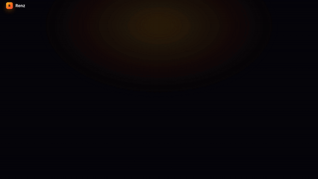

# Renz

<!-- brag:start -->
<p align="center">
  <a href="brag-output/brag.mp4"></a>
  <br>
  <sub>▶ <a href="brag-output/brag.mp4"><b>Watch the full launch video with voice-over</b></a> (38s, sound on)</sub>
</p>
<!-- brag:end -->


> An interactive full-stack playground that lets you build a **React frontend** and **Node.js backend** and **preview the output instantly in the browser**

With Renz, you can iterate on frontend and backend code together and see live results without switching tools or setting up local environments.

---

## 📸 Preview

<!-- Add your screenshots here -->


---

## 🚀 Features

This project enables:

- ⚡ **Live full-stack preview** — build React frontend and Node.js backend and see results instantly
- 🧩 **Frontend + Backend side-by-side development**
- 🖥 **In-browser code execution & rendering**
- 🔁 **Rapid iteration workflow**
- 📱 **Responsive UI designed for development workflows**
- 📁 **TypeScript-first codebase**

---

## 🛠 Tech Stack

- **Frontend:** Next.js (React)
- **Backend:** Node.js / Express
- **Language:** TypeScript
- **Deployment:** Vercel
- **Preview Engine:** In-browser rendering & API execution


## 💻 Getting Started

- Installation
```
git clone https://github.com/MonishPuttu/Renz.git
cd Renz
```
Run Frontend
```
cd Frontend
npm install
npm run dev
```
Open http://localhost:3000

Run Backend
```
cd Backend
npm install
npm start
```
